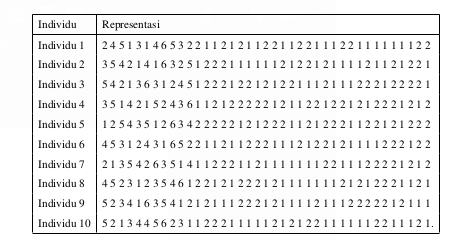

# Konten Skripsi baharudin

Pada dasarnya saya hanya mengambil data dari Burhanudin, karena kasus masalah yang sama-sama pada kasus rantai pasok tiga tahap. Selanjutnya skripsi kami berbeda dengan rincian perbedaan sebagai berikut

- Fungsi tujuan

    Fungsi tujuan pada baharudin adalah untuk mencari biaya meninimum dari operasional perusahaan selama kurun waktu setahun. Meskipun dinyatakan dalam beberapa fungsi objektif, tujuannya tetap hanya untuk mencari biaya minimum dari operasional perusahaan yang mana merupakan kumulasi dari biaya distribusi dan biaya operasional pabrik dan pengantongan. Fungsi objektif tersebut dapat ditunjukkan pada Gambar berikut.

    

    Adapaun pada skripsi saya adalah sebagai berikut

    

- Representasi Kromosom
    - baharudin menggunakan metode pengkodean/representasi kromosom berupa pengkodean permutasi.

    - Perbedan penggunaan metode pengkodean ini kemudian nampak pada jumlah gen yang ada pada suatu individu. Pada baharudin terdapat 84 gen dalam satu kromosom. Sementara pada skripsi saya hanya 39 gen.

        Selanjutnya pengkodean pada baharudin adalah sebagai berikut:

        

        sementara pada skripsi saya adalah sebagai berikut:

        

- Operasi Genetik
    - Operasi persilangna pada Burhanudin menggunakan metode persilangan satu titik
    - Operasi mutasi yang pada baharudin menggunakan metode *reciprocal exchange mutation*
    - Seleksi pada baharudin menggunakan metode seleksi turnamen

