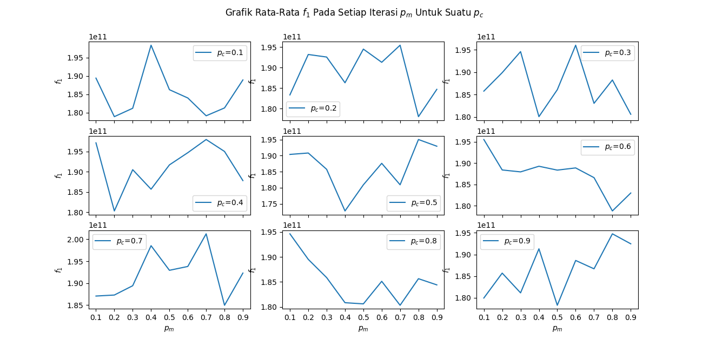
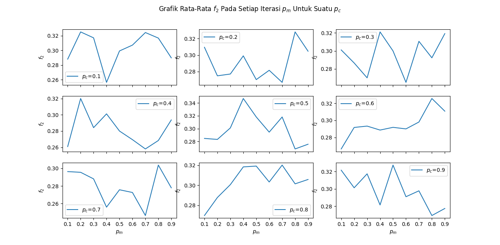
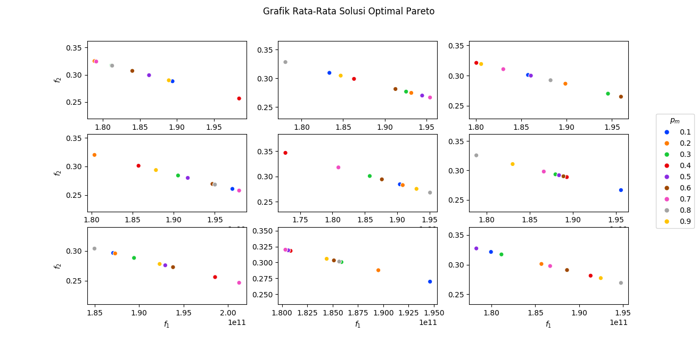

# Perbandingan Penggunaan Parameter Persilangan dengan Parameter Mutasi

Dalam hal ini dianalisa sebanyak 10 kali percobaan dengan digunakan 10 populasi dan 100 generasi. Diperoleh hasil sebagai mana pada Gambar berikut, dimana setiap grafik diambil dari rata-rata untuk penggunaan parameter persilangan dan parameter mutasi tertentu.

