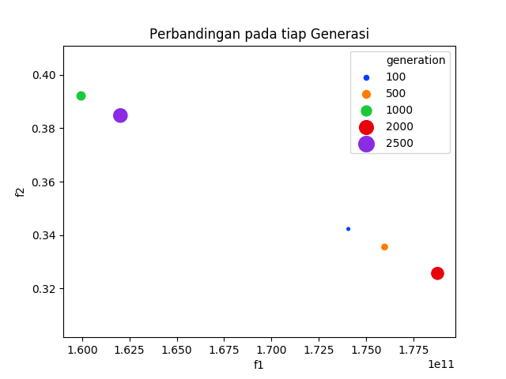

# Revisi


## Fitness

Fitness merupakan nilai hasil pemetaan terhadap fungsi objektif pada suatu pemodelan permasalahan.

## Tingkat Pemanfaatan
- Penulis mengganti istilah pemanfaatan menjadi penggunaan
- Fungsi objektif yang kedua pada pemodelan, ini merupakan fungsi yang bertujuan mencari tingkat kewajaran rasio penggunaan kapasitas dari pabrik dan gudang/pengantongan. 
- Pada umumnya rasio penggunaan kapasitas memiliki rumus sebagai berikut

    ```
    capacity utilization = actual level of output / maximum level of output x 100
    ```

- Dihitung dengan cara menghitung *mean square error* (MSE) rasio penggunaan kapasitas pabrik dan gudang/pengantongan.
- Fungsi objektif kedua pada pembahasan di skripsi digunakan akar dari MSE dan dari [statisticshowto.com](https://www.statisticshowto.com/rmse/) *Root Mean Squred Error* (RMSE) merupakan standar deviasi dari residual atau galat suatu prediksi(kalau dalam analisis regresi). Residual merupakan ukuran seberapa jauh suatu nilai terhadap garis regresi. RMSE mengukur sebaran dari residual atau dengan kata lain menyatakan seberapa data terkonsentrasi di sekitar garis regresi. RMSE biasa digunakan di masalah peramalan dan analisa regresi.

    Dengan menginterpretasikan sebagai standar deviasi maka standar deviasi yang kecil berarti bahwa nilai-nilai dalam set data statistik mendekati rata-rata set data, rata-rata, dan standar deviasi yang besar berarti bahwa nilai-nilai dalam set data lebih jauh dari rata-rata.

    Selanjutnya RMSE digunakan pada fungsi objektif tersebut untuk mencari nilai kewajaran dari tingkat penggunaan kapasitas masing-masing pabrik dan gudang/pengantongan.


- semakin kecil nilainya, semakin dekat rasio penggunaan kapasitas untuk setiap pabrik dan DC, sehingga memastikan permintaan didistribusikan secara adil di antara DC dan pabrik yang dibuka, dan dengan demikian memaksimalkan keseimbangan penggunaan kapasitas.


- 


## Peluang Bermutasi dan peluang Persilangan (Crossover)

- Mutasi dan Persilangan merupakan operasi yang digunakan untuk menjamin ekplorasi dan eksploitasi ruang pencarian atau daerah fisibel suatu permasalahan. Semakin tinggi peluang mutasi tidak bagus karena menghambat terjadi kekonvergenan.


## Kenapa diambil 2000 Generasi?
 - Keterbatasan device
 - Dengan data yang ada penulis mengira iterasinya sudah cukup banyak untuk menunjukkan solusi-solusi optimal Pareto di dalam daerah kriteria.
 - Dari analisa yang dilakukan penulis peroleh grafik sebagaimana berikut

    

    Data tersebut penulis ambil dari hasil solusi akhir pada setiap generasi yang terdefisnisi sebagaimana pada gambar tersebut.

    Menurut penulis bahwa pada iterasi atau generasi ke 100 sudah dapat ditemukan solusi optimal Pareto, namun demikian untuk penggunaan semakin generasi dapat semakin menunjukkan pareto front yang terbentuk.


